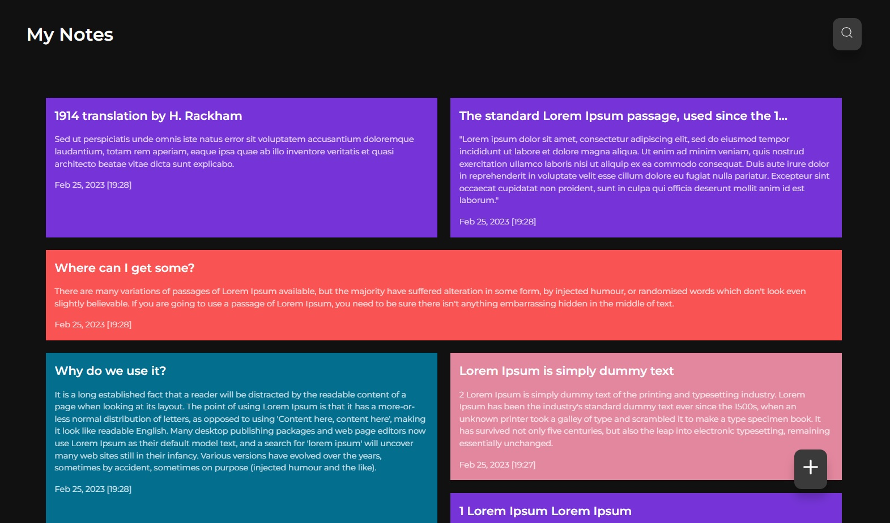

<h1 align="center">✍️ Welcome to React Notes App! ✍️</h1>

✍️ <strong> A modern responsive react notes app </strong>

✍️ <strong> Makes uses of HTML, CSS, ES6 JavaScript, and React </strong>

✍️ <strong> The ability to add/edit/delete/search notes </strong>

 Click <a href="https://react-notes-app-8uii.onrender.com/" target="_blank"><strong> Here</strong> </a> to view the deployed website at render.com 

